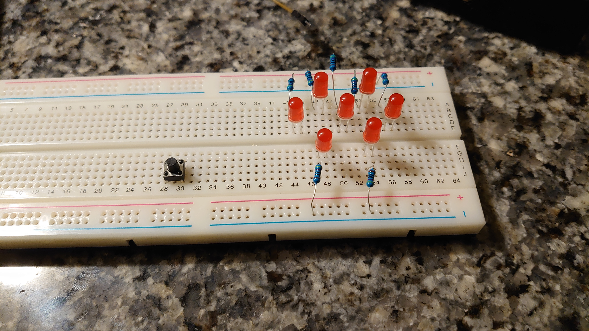

## Introduction

This Breadboard project demonstrates how to create a simple electronic dice game using a Raspberry Pi and a breadboard. The device simulates rolling two dice, providing a digital alternative to traditional physical dice. It's an excellent project for beginners learning about Raspberry Pi, GPIO programming, and basic electronics. The electronic dice can be used for board games, educational purposes, or as a fun way to make random selections.

## Components

- 1x Raspberry Pi  (Preferably Pi3,4,5 with GPIO pins)
- 1x Breadboard
- 7x 5mm RED LEDs
- 7x 330-1K Ohm Resistors
- 1x 12x12mm Push Buttons
- 11x Male to Female Jumper wires
- USB power supply for Raspberry Pi
## Setup

#### Step 1 
- Insert the Seven LED's into the bread board, make sure that the positive Anode leg (longer) is facing to the right side of the board for a correct orientation. Reference to the image below to also orient the LED's in a Honeycomb Pattern, with 5 LED's above the ridge between the breadboard and 2 LED's below the Ridge. This is so that resistors can be connected to the same trace as the LED's.

 


#### Step 2
- Insert the 7 Resistors (anything from 330 to 1000 Ohms) on one end lining up to the left leg (Cathode leg) of each LED. Connect the other end of the Resistor to the Negative rails of the Breadboard. The negative rails are located at the edges of the board indicated by a blue line and a negative symbol (-) next to the pin holes. 
- Insert a 12x12mm Push Button next to the breadboard either above or below the ridge on the breadboard (preferably close to the LEDs).




#### Step 3 
-  Use 8 Male to Female jumper wires to connect the LEDs to the GPIO pins on the Raspberry Pi. Each LED corresponds to a GPIO number on the pinout, Please see the pictures below for reference.
    
> [!WARNING]
> Do NOT connect the Raspberry Pi to power when connecting jumper wires from the Breadboard!


- Wire up the LEDs 1-7 to The GPIOs in this exact order: 
	- LED 1 -> GPIO 2
	- LED 2 -> GPIO 0 
	- LED 3 -> GPIO 3 
	- LED 4 -> GPIO 1
	- LED 5 -> GPIO 4
	- LED 6 -> GPIO 5 
	- LED 7 -> GPIO 6
- Wire up your Push Button to GPIO 14. It is recommended to color code your wires to Identify which ones are connected to which GPIO pin. In this exact order will help with the number patterns that will be illumated by the 7 LEDs on the Breadboard to simulate a Dice roll.


#### Step 4
- Ground out your connection by using 3 Male to Female Jumper wires from the negative rails on both sides of the Breadboard, and above the top left point of the Push Button (next to where the GPIO wire is connected) to 3 of the ground pins on the Raspberry Pi.


#### Step 5 
- Using a Python 3 script to execute code to run the Dice Game. I made a small script within the VIM text editor using the Gnome Terminal on 'Pop OS!' Linux, and pulling from a few sources and AI on the web to help with my coding. The logic behind the script was to detect all 7 LEDs and the Push Button, and run a random number generator from numbers 1-6 when the button is pressed. The Lights will flash replicating a dice roll animation. After a few seconds the LEDs will be illuminated to show a specific dot pattern corresponding to the number that was chosen by the number generator to resemble a dot pattern like on a face of a die (dice). The outcome will be printed by saying "You rolled a X!" at the end to signify which number you rolled. 
- The programs used were imported by the `gpiozero` library.
- The code will be shown below and can be copied for editing and further improvement. 
```Python
#!/usr/bin/env python3

from gpiozero import LED, Button
from time import sleep
import random

# Set up LEDs
leds = [LED(i) for i in range(7)]

# Set up button
button = Button(14)

# Define LED patterns for dice numbers
dice_patterns = [
    [0, 0, 0, 1, 0, 0, 0],  # 1
    [1, 0, 0, 0, 0, 0, 1],  # 2
    [1, 0, 0, 1, 0, 0, 1],  # 3
    [1, 1, 0, 0, 0, 1, 1],  # 4
    [1, 1, 0, 1, 0, 1, 1],  # 5
    [1, 1, 1, 0, 1, 1, 1]   # 6
]

def roll_dice():
    # Simulate dice rolling animation
    for _ in range(10):
        for pattern in dice_patterns:
            display_pattern(pattern)
            sleep(0.1)

    # Generate random number and display result
    result = random.randint(1, 6)
    display_pattern(dice_patterns[result - 1])
    return result

def display_pattern(pattern):
    for led, value in zip(leds, pattern):
        if value:
            led.on()
        else:
            led.off()

print("Press the button to roll the dice!")

while True:
    button.wait_for_press()
    result = roll_dice()
    print(f"You rolled a {result}")
    sleep(0.5)  # Debounce delay
```

[^2] [^3]

#### Step 6
- Executing the code within the Terminal on the Raspberry Pi
	- Boot up the Raspberry Pi and log in to access the Terminal on the Raspberry Pi OS. 
	- Follow the commands and syntax from the image below to execute the Python3 Script for the Dice Game. When you see the text "Press the button to roll the dice!" on the command line, press the button to start the game. 
	- Press `CTRL+C` to kill the Python Script. 

 [^1]


	## Work Cited 
[^1]: Raspberry Pi Official Website (2023) https://www.raspberrypi.com/documentation/computers/raspberry-pi.html
[^2]: Code Help, (2024) https://www.instructables.com/Electronic-Dice-Raspberry-Pi-Pico/
[^3]: Code Help, (2024) https://www.learnrobotics.org/blog/cool-arduino-projects-arduino-dice-simulation/


